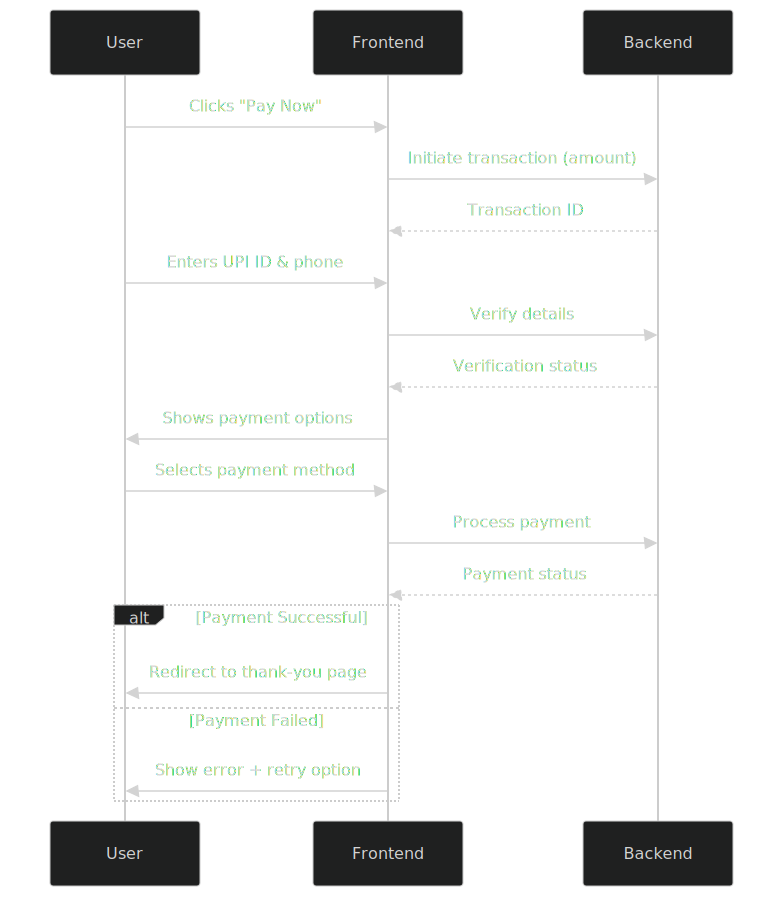

# 💳 UPI Payment Gateway Simulator

  
*A complete simulation of UPI payment processing*

## 🌟 Features

### Frontend Features
- ✔️ Modern, responsive UI with smooth animations
- ✔️ Dual payment options (QR code + UPI apps)
- ✔️ Real-time input validation for UPI IDs and phone numbers
- ✔️ Interactive countdown timer (3 minutes)
- ✔️ Copy-to-clipboard functionality

### Backend Features
- 🔒 Session-based transaction management
- ⏱ Simulated payment processing (2-5 seconds)
- 🎲 Configurable success rate (70% default)
- 📱 UPI deep linking support
- 🛡 Basic input sanitization

## 🛠 Tech Stack

| Component       | Technology |
|----------------|------------|
| Frontend       | HTML5, CSS3, JavaScript (jQuery) |
| Backend        | PHP 7.0+ |
| UI Framework   | Custom CSS with Font Awesome icons |
| API Simulation | REST-like endpoints |

## 🚀 Quick Start

### Prerequisites
- PHP 7.0 or higher
- Web server (Apache/Nginx) or PHP built-in server
- Modern web browser

## 📁 Project Structure


````
upi-payment-gateway/
├── index.html            # Main payment interface
├── payment-api.php       # Backend API endpoints
├── thank-you.html        # Payment success page
├── images/               # Static assets
│   └── secured.png      # Security 
````
## ⚙ Configuration
### Frontend Configuration (index.php)
````
const paymentGateway = new UPIPaymentGateway({
  amount: 1000,          // Amount in paise (₹10 = 1000 paise)
  merchantName: 'Your Business Name',
  merchantUpiId: 'business@upi', 
  themeColor: '#005bf2'  // Primary button color
});
````
### Backend Configuration (payment-api.php)
````
// Merchant details
const MERCHANT_UPI_ID = 'business@upi';
const MERCHANT_NAME = 'Your Business Name';

// Payment settings
const MIN_AMOUNT = 100;  // Minimum ₹1 (100 paise)
const SUCCESS_RATE = 0.7; // 70% success probability
````

## 🔄 Payment Flow Diagram

 
## 🧪 Testing Scenarios
- Test Case	Expected Result
- Valid UPI ID (name@bank)	``Accepts input``
- Invalid UPI ID (name@)	``Shows error``
- 10-digit phone number	``Accepts input``
- 9-digit phone number	``Shows error``
- Amount < ₹1	``Rejects transaction``
- Payment success case	Redirects to  thank-you page
- Payment failure case	``Shows error message ``